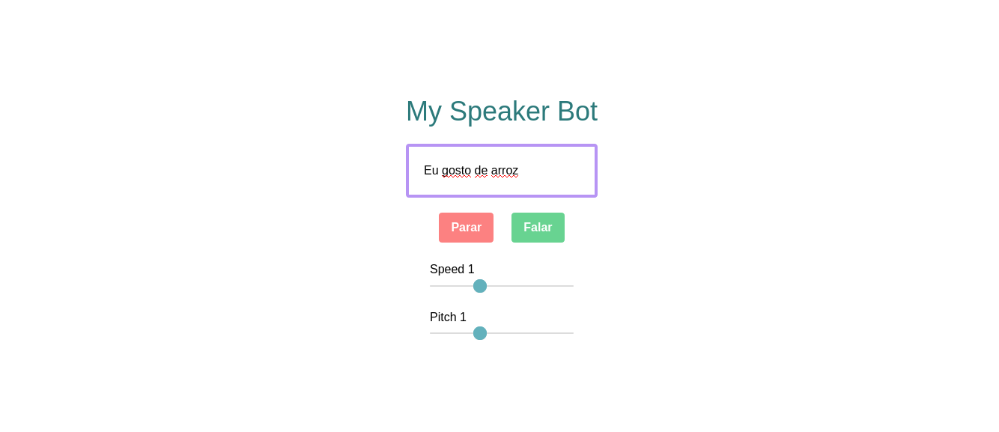

# My speaker bot

Aplicação que usa a api do SpeechSynthesis para ler um conteúdo de uma div. Além disso, as propriedades da voz podem ser customizadas a partir dos controles.

## Motivação 😎
 -> Esse projeto foi criado como diversão e para consolidar meus estudos em Jabascript.
## Tecnologias Utilizadas 🖥
- Html
- Javascript Vanilla
- [TailwindCSS](https://tailwindcss.com/)

## Como usar 🤔

### Desenvolvimento ⌨

Na pasta do projeto, abra o arquivo **index.html** e divirta-se!

## Author 🧙🏻

Renan de Andrade Correa 🤵🏻

#### Notas
- Deixe aquela ⭐ delicinha 🤗
- Acredite em você mesmo e nunca pare de estudar 😁